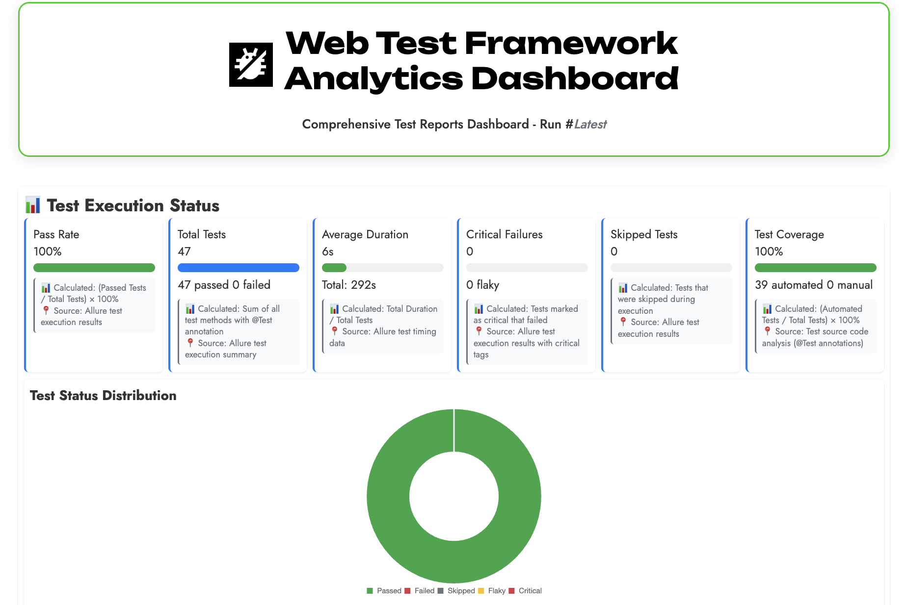
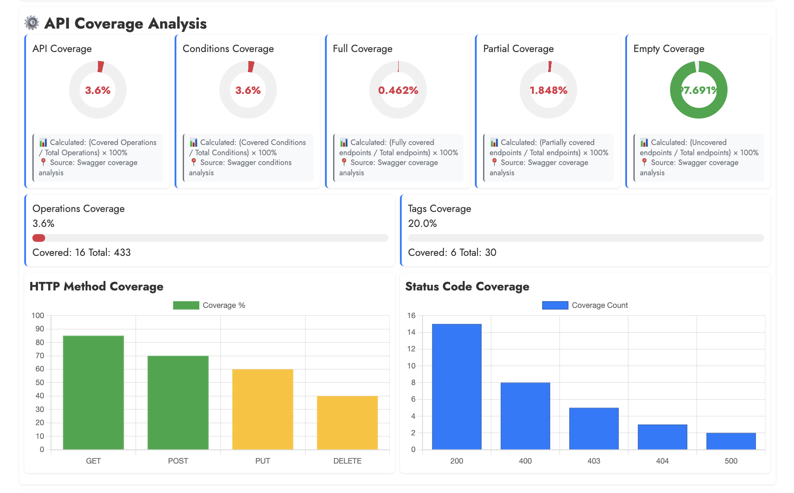

# TeamCity Testing Framework

A comprehensive testing framework for TeamCity API and UI automation, built with Java, TestNG, Selenide, and REST Assured.

## 🎯 What We Test

- **API Testing**: Full CRUD operations for projects, build types, users, and agents
- **UI Testing**: End-to-end user workflows with browser automation
- **Integration Testing**: Cross-component functionality validation

## 🏗️ Architecture


### Framework Layers

1. **Test Layer**: TestNG tests with base classes
2. **Page Object Layer**: UI elements and actions encapsulation
3. **API Layer**: HTTP requesters and data models
4. **Utilities Layer**: Data generation, specifications, and assertions
5. **Infrastructure Layer**: Selenide, REST Assured, Allure, Docker

## ✨ Best Practices Applied

- **Page Object Model (POM)**: UI elements encapsulation
- **Fluent Interface**: Method chaining for readable code
- **Builder Pattern**: Flexible object creation
- **Factory Pattern**: Centralized object creation
- **Data-Driven Testing**: TestNG DataProviders
- **Parallel Execution**: Thread-safe design
- **Comprehensive Reporting**: Allure integration

## 🚀 Getting Started

### Prerequisites
- Java 21+
- Maven 3.8+
- Docker and Docker Compose

### Quick Start

```bash
# 1. Clone repository
git clone https://github.com/NoBugs-Projects/w1.git
cd w1

# 2. Start infrastructure
docker-compose up -d

# 3. Run tests
mvn test

# 4. View reports
mvn allure:serve
```

### Configuration

Create `src/main/resources/config.properties`:

```properties
host=localhost:8111
superUserToken=your-super-user-token
browser=chrome
remote=http://localhost:4444/wd/hub
```

## 🏃‍♂️ Running Tests

```bash
# Run all tests
mvn test

# Run specific test
mvn test -Dtest=ProjectTest

# Run with specific browser
mvn test -Dbrowser=firefox

# Run specific groups
mvn test -Dgroups=Regression

# Run in parallel
mvn test -Dparallel=methods -DthreadCount=4
```

## 🔄 CI/CD Pipeline

### GitHub Actions Workflow

1. **Checkout Code**
2. **Setup Java Environment**
3. **Cache Dependencies**
4. **Validate Code Style** (Checkstyle)
5. **Run Tests**
6. **Generate Reports**
7. **Publish Reports**
8. **Send Telegram Notification**

### Required Secrets

- `TELEGRAM_BOT_TOKEN`: Your Telegram bot token
- `TELEGRAM_CHAT_ID`: Target chat/channel ID

## 📊 Reports

### Allure Report


### Test Results Overview


### Report URLs (CI)
- **Test Report**: `https://nobugs-projects.github.io/w1/{run_number}/`
- **Allure Report**: `https://nobugs-projects.github.io/w1/{run_number}/allure-report/`
- **Swagger Coverage**: `https://nobugs-projects.github.io/w1/{run_number}/swagger-coverage-report/`

## ⚙️ Configuration

| Variable | Description | Default |
|----------|-------------|---------|
| `browser` | Browser for UI tests | `chrome` |
| `host` | TeamCity server host | `localhost:8111` |
| `remote` | Selenoid remote URL | `http://localhost:4444/wd/hub` |

### Supported Browsers
- Chrome, Firefox, Opera

### Test Groups
- Regression, Smoke, API, UI

## 🤝 Contributing

1. Fork the repository
2. Create a feature branch
3. Make your changes
4. Add tests for new functionality
5. Ensure all tests pass
6. Submit a pull request

---

**Happy Testing! 🧪✨**